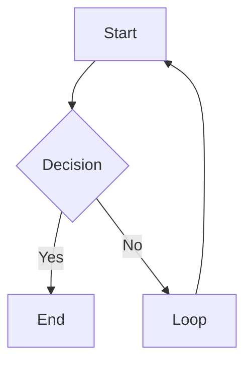

# obsidian-markdown: Obsidian Flavored Markdown

Tento skill referencuj při psaní libovolné wiki stránky. Obsidian rozšiřuje standardní Markdown o wikilinky, embeds, callouty a properties. Špatná syntaxe způsobuje rozbité odkazy, neviditelné callouty nebo špatně formátovaný frontmatter.

**Cross-reference**: Pokud je nainstalován plugin kepano/obsidian-skills, preferuj jeho kanonický skill obsidian-markdown jako autoritativní referenci. Jinak použij níže uvedenou referenci. Viz také [github.com/kepano/obsidian-skills](https://github.com/kepano/obsidian-skills).

---

## Wikilinky

Interní odkazy používají dvojité hranaté závorky. Název souboru bez přípony.

| Syntaxe | Co dělá |
|---|---|
| `[[Note Name]]` | Základní odkaz |
| `[[Note Name\|Display Text]]` | Aliasovaný odkaz (zobrazí „Display Text") |
| `[[Note Name#Heading]]` | Odkaz na konkrétní nadpis |
| `[[Note Name#^block-id]]` | Odkaz na konkrétní blok |

Pravidla:
- Na některých systémech case-sensitive. Trefte přesný název souboru.
- Cestu nepotřebujete: Obsidian řeší podle unikátnosti názvu.
- Pokud mají dva soubory stejný název, použijte `[[Folder/Note Name]]` pro disambiguaci.

---

## Embeds

Embeds používají `!` před wikilinkem. Zobrazují obsah inline.

| Syntaxe | Co dělá |
|---|---|
| `![[Note Name]]` | Embed celé poznámky |
| `![[Note Name#Heading]]` | Embed sekce |
| `![[image.png]]` | Embed obrázku |
| `![[image.png\|300]]` | Embed obrázku se šířkou 300 px |
| `![[document.pdf]]` | Embed PDF (Obsidian renderuje nativně) |
| `![[audio.mp3]]` | Embed audia |

---

## Callouty

Callouty jsou blockquotes s typovým klíčovým slovem. Renderují se jako stylované alert boxy.

```markdown
> [!note]
> Výchozí informační callout.

> [!note] Vlastní titulek
> Callout s vlastním titulkem.

> [!note]- Sbalitelný (výchozí zavřený)
> Klikněte pro rozbalení.

> [!note]+ Sbalitelný (výchozí otevřený)
> Klikněte pro sbalení.
```

### Všechny typy calloutů

| Typ | Aliasy | Použití |
|------|---------|---------|
| `note` | : | Obecné poznámky |
| `abstract` | `summary`, `tldr` | Souhrny |
| `info` | : | Informace |
| `todo` | : | Akční položky |
| `tip` | `hint`, `important` | Tipy a zvýraznění |
| `success` | `check`, `done` | Pozitivní výsledky |
| `question` | `help`, `faq` | Otevřené otázky |
| `warning` | `caution`, `attention` | Varování |
| `failure` | `fail`, `missing` | Chyby nebo selhání |
| `danger` | `error` | Kritické problémy |
| `bug` | : | Známé bugy |
| `example` | : | Příklady |
| `quote` | `cite` | Citace |
| `contradiction` | : | Konfliktní informace (wiki konvence) |

---

## Properties (Frontmatter)

Obsidian renderuje YAML frontmatter jako Properties panel. Pravidla:

```yaml
---
type: concept                    # plain string
title: "Note Title"              # v uvozovkách, pokud obsahuje speciální znaky
created: 2026-04-08              # datum jako YYYY-MM-DD (ne ISO datetime)
updated: 2026-04-08
tags:
  - tag-one                      # položky seznamu jako - format
  - tag-two
status: developing
related:
  - "[[Other Note]]"             # wikilinky musí být v YAML uvozovkách
sources:
  - "[[source-page]]"
---
```

Pravidla:
- Pouze plochý YAML. Nikdy nehnízdit objekty.
- Data jako `YYYY-MM-DD`, ne `2026-04-08T00:00:00`.
- Seznamy jako `- item`, ne inline `[a, b, c]`.
- Wikilinky v YAML musí být v uvozovkách: `"[[Page]]"`.
- Pole `tags`: Obsidian to čte jako seznam tagů, vyhledávatelný ve vault.

---

## Tagy

Dvě platné formy:

```markdown
#tag-name             : inline tag kdekoli v těle
#parent/child-tag     : zanořený tag (zobrazuje hierarchii v tag panelu)
```

Ve frontmatter:
```yaml
tags:
  - research
  - ai/obsidian
```

Nepoužívejte `#` uvnitř seznamů tagů ve frontmatter. Jen název tagu.

---

## Formátování textu

Standardní Markdown plus Obsidian rozšíření:

| Syntaxe | Výsledek |
|---|---|
| `**bold**` | Tučné |
| `*italic*` | Kurzíva |
| `~~strikethrough~~` | Přeškrtnutí |
| `==highlight==` | Zvýrazněný text (žlutě v Obsidianu) |
| `` `inline code` `` | Inline kód |

---

## Math

Obsidian používá MathJax/KaTeX:

Inline math:
```markdown
$E = mc^2$
```

Blokové math:
```markdown
$$
\int_0^\infty e^{-x} dx = 1
$$
```

---

## Code bloky

Standardní fenced code bloky. Obsidian zvýrazňuje všechny běžné jazyky:

````markdown
```python
def hello():
    return "world"
```
````

---

## Tabulky

Standardní Markdown tabulky:

```markdown
| Sloupec A | Sloupec B | Sloupec C |
|----------|----------|----------|
| Hodnota   | Hodnota   | Hodnota   |
| Hodnota   | Hodnota   | Hodnota   |
```

Obsidian renderuje tabulky nativně. Žádný plugin není potřeba.

---

## Mermaid diagramy

Obsidian renderuje Mermaid nativně:

````markdown

````

Podporováno: `graph`, `sequenceDiagram`, `gantt`, `classDiagram`, `pie`, `flowchart`.

---

## Footnotes

```markdown
Tato věta má footnote.[^1]

[^1]: Text footnote sem.
```

---

## Co NEDĚLAT

- Nepoužívejte `[link text](path/to/note.md)` pro interní odkazy: použijte `[[Note Name]]`.
- Nepoužívejte HTML uvnitř calloutů: držte se Markdownu.
- Nepoužívejte `##` uvnitř těla calloutu: nadpisy uvnitř calloutů se nerenderují.
- Nepište `tags: [a, b, c]` inline ve frontmatter: Obsidian preferuje formát seznamu.
- Nepište ISO datetime ve frontmatter (`2026-04-08T00:00:00Z`): použijte `2026-04-08`.
